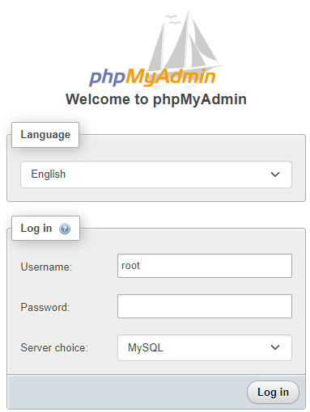
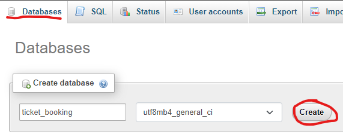
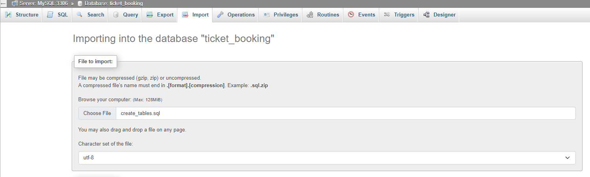

[![Forks][forks-shield]][forks-url]
[![Stargazers][stars-shield]][stars-url]
[![Issues][issues-shield]][issues-url]

<!-- PROJECT LOGO -->
<br />
<div align="center">
  <a href="https://github.com/jeezusplays/ticket-booking-system">
    
  </a>

<h3 align="center">Ticks - Ticket Booking System</h3>

  <p align="center">
    Manage booking of tickets for music concerts and events!
    <br />
    <a href="https://github.com/jeezusplays/ticket-booking-system"><strong>Explore the docs »</strong></a>
    <br />
    <br />
    <a href="https://github.com/jeezusplays/ticket-booking-system">View Demo</a>
    ·
    <a href="https://github.com/jeezusplays/ticket-booking-system/issues">Report Bug</a>
    ·
    <a href="https://github.com/jeezusplays/ticket-booking-system/issues">Request Feature</a>
  </p>
</div>


## About The Project
Ticks manages the booking of tickets for various events, such as music concerts, theatre shows, and seminars. The system allows users to view available events, book tickets, and view their booking history. The system also allows event organizers to add new events, view event details, and view the list of attendees for their events.

## Getting Started
### Prerequisites
* Ensure you have [WAMP](https://www.wampserver.com/en/download-wampserver-64bits/) installed on your machine.
* Ensure WAMP is  running locally.

### Database Setup
To set up the database needed for the ticket booking system, follow these steps:

1. Open phpMyAdmin in your web browser on your local machine (https://localhost/phpmyadmin).

2. Log in with your MySQL server's username and password.<br>


3. Once logged in, click on the "Databases" tab in the top navigation bar and create a database called `ticket_booking` with `utf8mb4_general_ci` setting.


4. Import the sql scripts `create_tables.sql` and `insert_data.sql` in this order<br>


### Installation
1. Clone the repo
   ```sh
   git clone https://github.com/jeezusplays/ticket-booking-system
    ```
2. Set up database via instruction above
3. Run TicketBookingApp.jar
    ```sh
    java -jar ./out/artifacts/TicketBookingApp_jar/TicketBookingApp.jar
    ```
<!-- 3. Install NPM packages (if applicable)
   ```sh
   npm install
   ```
3. Start the development server.
    ```sh
    npm start
    ```
4. Open the project in your browser.
    ```sh
    open http://localhost:3000
    ``` -->

## Usage
<!-- To use the application, follow these steps:
1. Open the application in a web browser.
2. Follow the on-screen instructions to navigate through the application's features.
3. If prompted, enter any required input values or select desired options.
4. When finished, exit the application or close the web browser. -->

## Contributing
If you have a suggestion that would make this better, please fork the repo and create a pull request. You can also simply open an issue with the tag "enhancement".
**Don't forget to give the project a :star: star :star:!** Thanks again!

1. Fork the Project
2. Create your Feature Branch (`git checkout -b /newFeature`)
3. Commit your Changes (`git commit -m 'Add some newFeature'`)
4. Push to the Branch (`git push origin /newFeature`)
5. Open a Pull Request

## Contact
Feel free to contact and connect!

|| Name | Main Role | Github | LinkedIn |
|-----------| ----------- | ----------- | ----------- | ----------- |
|</img>|Tan Zuyi Joey|Project Manager|[](https://github.com/jeezusplays)|[](https://linkedin.com/in/joey-tan-zuyi)|


[forks-shield]: https://img.shields.io/github/forks/jeezusplays/ticket-booking-system.svg?style=for-the-badge
[forks-url]: https://github.com/jeezusplays/ticket-booking-system/network/members
[stars-shield]: https://img.shields.io/github/stars/jeezusplays/ticket-booking-system.svg?style=for-the-badge
[stars-url]: https://github.com/jeezusplays/ticket-booking-system/stargazers
[issues-shield]: https://img.shields.io/github/issues/jeezusplays/ticket-booking-system.svg?style=for-the-badge
[issues-url]: https://github.com/jeezusplays/ticket-booking-system/issues
